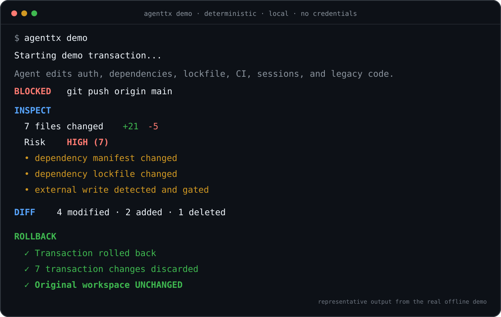

# AgentTX

**Make AI agents undoable.**

Run AI coding agents inside isolated Git transactions.

Inspect everything they changed. Commit the good. Roll back the bad.

```bash
npx agenttx run claude
```



✓ isolated repository workspace · ✓ full diff · ✓ rollback · ✓ conflict detection · ✓ transaction history · ✓ risk inspection · ✓ secret redaction · ✓ no cloud required

## Quick start

AgentTX requires Node.js 20+ and Git. Start from a Git repository with at least one commit.

```bash
npx agenttx doctor
npx agenttx run <your-agent-command>
npx agenttx inspect
```

Then accept the transaction-relative file changes:

```bash
npx agenttx commit
```

Or discard them without changing your original working tree:

```bash
npx agenttx rollback
```

Try the real, deterministic, credential-free demo after installing AgentTX:

```bash
agenttx demo
```

## Why AgentTX?

Coding agents can now change source, dependencies, CI, and Git state across an entire repository. Git helps after changes reach your working tree, while permission prompts answer only whether an action may run. AgentTX gives each session a transaction boundary: work happens elsewhere, the result is inspectable, and acceptance is explicit. If the result is wrong, rollback removes the isolated workspace. Your original repository remains available throughout.

## How it works


AgentTX captures the repository baseline, builds an independent local clone, overlays tracked and non-ignored untracked changes, and runs the child from the matching directory. When the child exits, the transaction enters `REVIEW`. Acceptance first checks every touched path against its start-time fingerprint; overlapping user changes stop the operation before any transaction file is applied.

`agenttx commit` accepts files into the original working tree. It does **not** create or stage a Git commit.

## Commands

| Command | Purpose |
|---|---|
| `agenttx run [--allow-external] [--] <command...>` | Run any command in a new transaction |
| `agenttx status [id] [--json]` | Show transaction state |
| `agenttx diff [id] [--stat\|--full]` | Review changed files or the redacted patch |
| `agenttx inspect [id] [--json]` | Show changes, side effects, risk, and checks |
| `agenttx verify [id] [--run]` | Discover checks; run them only with `--run` |
| `agenttx commit [id]` | Accept transaction files after conflict checks |
| `agenttx rollback [id]` | Discard the isolated transaction |
| `agenttx history [--json]` | List local transaction history |
| `agenttx replay <id> [--json]` | Read recorded events; it does not re-execute |
| `agenttx report [id] --html` | Write a standalone redacted HTML report |
| `agenttx doctor [--json]` | Check Node, Git, repository state, storage, and agent CLIs |
| `agenttx demo [--keep]` | Run the offline seven-file demo |

Machine consumers can use `status --json` and `inspect --json`. Their versioned examples are in [the schema reference](docs/SCHEMAS.md).

## Works around the agent, not instead of it

The durable interface is arbitrary command wrapping:

```bash
agenttx run claude
agenttx run codex
agenttx run gemini
agenttx run opencode
agenttx run -- node scripts/my-local-agent.mjs
```

Named adapters identify common CLIs; they do not depend on private agent hooks. Availability and interactive behavior still depend on the installed tool and platform. See [agent compatibility](docs/AGENT_COMPATIBILITY.md) for the distinction between generic support and explicit smoke tests.

## Safety model

AgentTX gives a strong, narrow repository guarantee: before acceptance, rollback removes only the isolated transaction workspace; acceptance refuses overlapping changes in the original repository and restores from a recovery backup if file application fails.

AgentTX is **not an OS security boundary**. The child retains your normal user permissions and can reach files outside the transaction repository. Selected external commands are detected and gated through top-level matching and best-effort `PATH` shims, which absolute binaries, renamed tools, libraries, in-process network calls, or other routes can bypass. `--allow-external` permits detected actions but does not make them reversible.

No telemetry, account, API key, Docker daemon, or cloud service is required. AgentTX does not upload code, paths, prompts, commands, diffs, or transaction metadata.

Read [SECURITY.md](SECURITY.md), [the exact security model](docs/SECURITY_MODEL.md), and [the threat model](docs/THREAT_MODEL.md) before relying on AgentTX around untrusted code.

## Honest V0 limitations

- Requires a non-bare Git repository with at least one commit.
- Rejects submodules and active merge, cherry-pick, revert, or bisect operations.
- Does not copy ignored files such as `node_modules`, caches, and commonly `.env`.
- Side-effect interception and Windows command shims are best effort.
- Cannot reverse Git pushes or arbitrary external-system changes.
- Secret redaction covers common formats, not every possible credential.
- Rollback is unavailable after acceptance; resume is not implemented.
- Independent clones trade setup time and disk for simple isolation and separate Git objects.

AgentTX V0 optimizes for correctness over workspace setup speed. See the [measured benchmarks](docs/BENCHMARKS.md).

## Project

- [Why AgentTX](docs/WHY_AGENTTX.md) — the category thesis
- [Why transactions](docs/WHY_TRANSACTIONS.md) — technical design reasoning
- [Roadmap](docs/ROADMAP.md) — now, next, and later without date promises
- [Examples](examples/basic/README.md) — safe, local examples
- [Contributing](CONTRIBUTING.md) — setup and architecture map
- [Changelog](CHANGELOG.md) — released behavior

AgentTX is local-first open-source infrastructure under the [MIT License](LICENSE).
