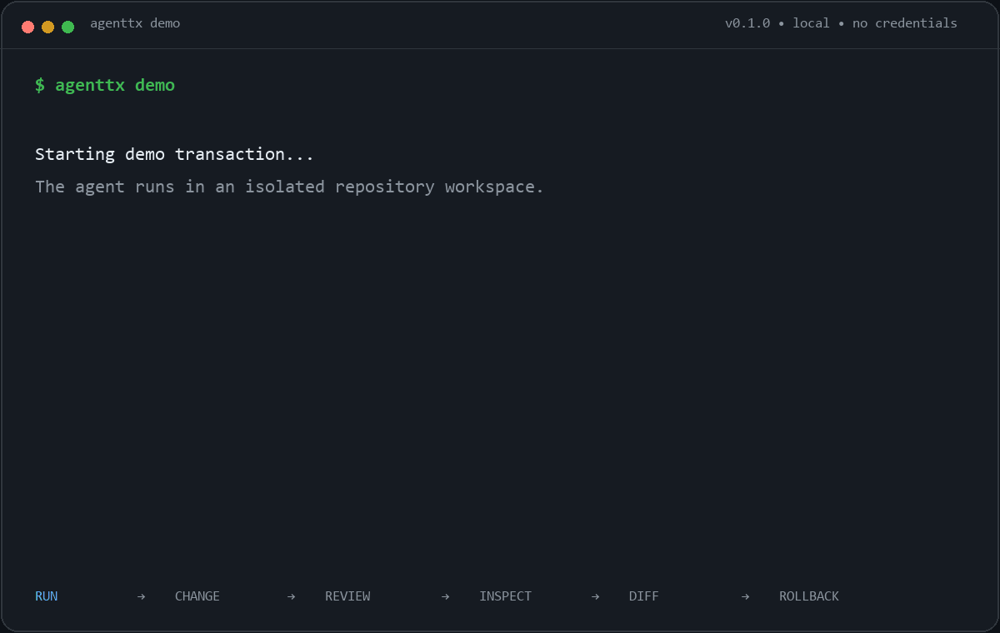
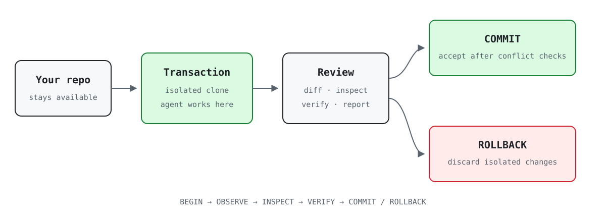

# AgentTX

**Make AI agents undoable.**

**Git-style transactions for AI coding agents.**

Run an agent in an isolated repository transaction. Inspect everything it changed. Commit the good. Roll back the bad.

[](https://www.npmjs.com/package/agenttx)
[](https://github.com/aliengineering-byte/agenttx/actions/workflows/ci.yml)
[](LICENSE)
[](https://nodejs.org/)



**Run → Inspect → Commit / Rollback**

[Static demo frame](docs/assets/agenttx-demo.png) · [Plain-text transcript](docs/assets/terminal-demo.txt)

## Quick start

AgentTX requires Node.js 20+ and Git. Start inside a Git repository with at least one commit.

```bash
npm install --global agenttx
cd my-project
agenttx run <coding-agent>
```

When the agent exits, review the transaction:

```bash
agenttx diff
agenttx inspect
```

Then accept its file changes—or discard the entire transaction:

```bash
agenttx commit
# or
agenttx rollback
```

`agenttx commit` applies files to your working tree; it does **not** create or stage a Git commit.
`agenttx rollback` also writes a redacted `rollback-evidence.json` with discarded-change counts, a bound terminal event, and content-sensitive before/after digests recording whether the Git-visible original workspace stayed unchanged. Verify its unsigned integrity offline with `agenttx verify-evidence <file>`.

Try the real, deterministic demo with no model, credentials, remote, or network write:

```bash
agenttx demo
```

## The transaction boundary

AgentTX runs the child command inside an independent local Git clone, from the equivalent repository directory. Your original working tree stays available and unchanged until you explicitly accept the transaction. After the child exits, inspect its diff, verification results, detected side effects, and risk; then commit or roll back.

> **Security boundary:** AgentTX v0.2.0 isolates supported repository changes, not the operating system. Child processes retain your normal user permissions, and external-action detection is heuristic. Read the [security model](docs/SECURITY_MODEL.md).

## Why AgentTX?

Coding agents can change source, dependencies, CI, and Git state across an entire repository. Git gives us the underlying isolation primitives; AgentTX packages them into an agent-oriented lifecycle with dirty-baseline capture, a ledger, inspection, verification, conflict-safe acceptance, rollback, and history.

## How it works



AgentTX captures the repository baseline, builds an independent local clone, overlays tracked and non-ignored untracked changes, and runs the child from the matching directory. When the child exits, the transaction enters `REVIEW`. Acceptance first checks every touched path against its start-time fingerprint; overlapping user changes stop the operation before any transaction file is applied.

## Commands

| Command | Purpose |
|---|---|
| `agenttx run [--allow-external] [--] <command...>` | Run any command in a new transaction |
| `agenttx status [id] [--json]` | Show transaction state |
| `agenttx diff [id] [--stat\|--full]` | Review changed files or the redacted patch |
| `agenttx inspect [id] [--json]` | Show changes, side effects, risk, and checks |
| `agenttx verify [id] [--run]` | Discover checks; run them only with `--run` |
| `agenttx commit [id]` | Accept transaction files after conflict checks |
| `agenttx rollback [id]` | Discard the isolated transaction and write rollback evidence |
| `agenttx history [--json]` | List local transaction history |
| `agenttx replay <id> [--json]` | Read recorded events; it does not re-execute |
| `agenttx evidence <id> [--output path]` | Regenerate redacted rollback evidence from the terminal ledger |
| `agenttx verify-evidence <file>` | Offline-check receipt integrity and derivable invariants; it does not authenticate the artifact |
| `agenttx report [id] --html` | Write a standalone redacted HTML report |
| `agenttx doctor [--json]` | Check Node, Git, repository state, storage, and agent CLIs |
| `agenttx demo [--keep]` | Run the offline seven-file demo |

Machine consumers can use `status --json` and `inspect --json`. Their versioned examples are in [the schema reference](docs/SCHEMAS.md).

## Works around the agent, not instead of it

The durable interface is arbitrary command wrapping:

```bash
agenttx run claude
agenttx run codex
agenttx run gemini
agenttx run opencode
agenttx run -- node scripts/my-local-agent.mjs
```

Named adapters identify common CLIs; they do not depend on private agent hooks. Availability and interactive behavior still depend on the installed tool and platform. See [agent compatibility](docs/AGENT_COMPATIBILITY.md) for the distinction between generic support and explicit smoke tests.

Using AgentTX with Claude Code, Codex, Gemini CLI, OpenCode, or another coding agent? [Open a compatibility report](https://github.com/aliengineering-byte/agenttx/issues/new?template=agent-compatibility.yml). Real reports determine which agent-specific workflows receive deeper testing.

Found another problem or workflow gap? Open a [sanitized bug report](https://github.com/aliengineering-byte/agenttx/issues/new?template=bug.yml) or a [focused feature request](https://github.com/aliengineering-byte/agenttx/issues/new?template=feature.yml).

## Safety model

AgentTX gives a strong, narrow repository guarantee: before acceptance, rollback removes only the isolated transaction workspace; acceptance refuses overlapping changes in the original repository and restores from a recovery backup if file application fails.

AgentTX is **not an OS security boundary**. The child retains your normal user permissions and can reach files outside the transaction repository. Selected external commands are detected and gated through top-level matching and best-effort `PATH` shims, which absolute binaries, renamed tools, libraries, in-process network calls, or other routes can bypass. `--allow-external` permits detected actions but does not make them reversible.

No telemetry, account, API key, Docker daemon, or cloud service is required. AgentTX does not upload code, paths, prompts, commands, diffs, or transaction metadata.

Rollback receipts are unsigned and recomputable. Their outer hash detects accidental or partial modification, while the offline verifier also checks the bound terminal event, metadata/diff references, and derived workspace result. It is integrity checking, not authentication against someone able to rewrite the complete local receipt and ledger.

Read [SECURITY.md](SECURITY.md), [the exact security model](docs/SECURITY_MODEL.md), and [the threat model](docs/THREAT_MODEL.md) before relying on AgentTX around untrusted code.

## Honest V0 limitations

- Requires a non-bare Git repository with at least one commit.
- Rejects submodules and active merge, cherry-pick, revert, or bisect operations.
- Does not copy ignored files such as `node_modules`, caches, and commonly `.env`.
- Side-effect interception and Windows command shims are best effort.
- Cannot reverse Git pushes or arbitrary external-system changes.
- Secret redaction covers common formats, not every possible credential.
- Rollback is unavailable after acceptance; resume is not implemented.
- Independent clones trade setup time and disk for simple isolation and separate Git objects.

AgentTX V0 optimizes for correctness over workspace setup speed. See the [measured benchmarks](docs/BENCHMARKS.md).

## Project

- [Why AgentTX](docs/WHY_AGENTTX.md) — the category thesis
- [Why transactions](docs/WHY_TRANSACTIONS.md) — technical design reasoning
- [Roadmap](docs/ROADMAP.md) — now, next, and later without date promises
- [Examples](examples/basic/README.md) — safe, local examples
- [Contributing](CONTRIBUTING.md) — setup and architecture map
- [Changelog](CHANGELOG.md) — released behavior

AgentTX is local-first open-source infrastructure under the [MIT License](LICENSE).
